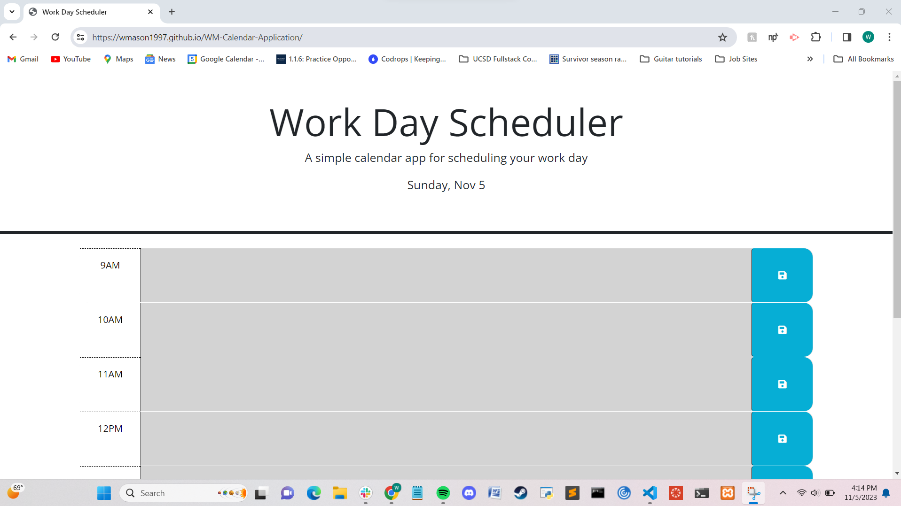
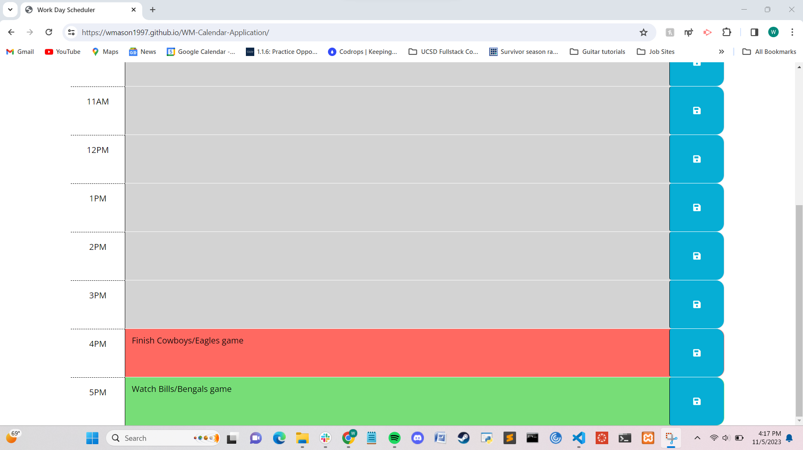

# WM-Calendar-Application

## Description ##
The goal of this project was to create an online website application that allowed the user to save events for each hour block within the standard 9 AM to 5 PM workday, essentially functioning as a daily planner. The date is displayed at the top of the page with the help of the dayjs library and the hour blocks are color-coordinated for past (grey), present (red), and future (green) also with the help of the dayjs library.

The new tool that we were intended to utilize in this project was jQuery to dynamically update the HTML and CSS stylings that were applied. The project utilizes local storage to retain saved TODOs upon website page refresh.

## Credits ##
The starter code was from the Develop folder that was housed in the Challenge folder within the week 05-Third-Party-APIs folder of the UCSD-VIRT-FSF-PT-09-2023-U-LOLC GitLab repository. User mvpache (Instructor Michael Pacheco) made the most recent updates to this GitLab repository.

I did the day formatting according to [https://day.js.org/docs/en/display/format](https://day.js.org/docs/en/display/format).

I consulted chatGPT for help on how to exclude the "hour-" part of each hour-x block in my updateHours() function's for loop. This resulted in using the substring method starting at the 5th index, when the hour number itself started.

I had a tutoring session with Mila Hose on 11/05/2023. They helped me to write the event saving and retrieving with jQuery as opposed to Vanilla JS. They also helped me use template literals to target the specific time blocks with the relevant saved information. They also instructed me that, to be safe, I should move the dayDisplayEl and timeBlockEls variables inside the anonymous function, which I did. Thanks Mila!

## Screenshots ##

## Link to Deployed Application ##
[William Mason's Calendar Application](https://wmason1997.github.io/WM-Calendar-Application/)